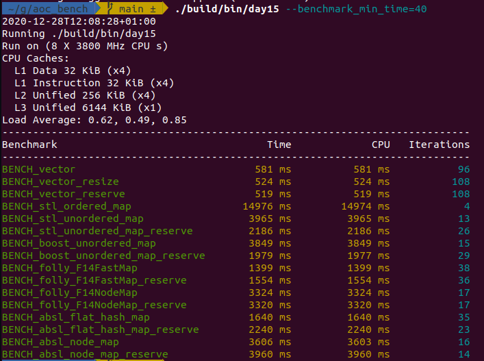

# aoc_bench

benchmarking AdventofCode solutions

Install folly: https://github.com/facebook/folly
To turn of CPU frequency scaling I used:  
```
sudo cpupower frequency-set --governor performance  
```

```
pip install conan  
mkdir build && cd build  
conan install .. --build=missing  
cmake ..  
./bin/day15 --benchmark_min_time=40  
```

